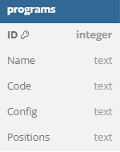
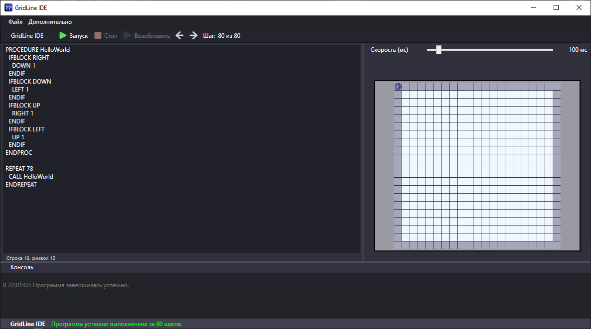

<p align="center">
    <br>
      
      <h1 align="center">GridLine IDE</h1>
    <br>
<p>

Команда: MLP Reborn

<b> GridLine IDE <b> — это среда разработки для языка программирования [LangLine](https://github.com/TUBIK-corp/LangLine), который предназначен для управления движением исполнителя по двумерной сетке. GridLine IDE позволяет создавать, редактировать, запускать и отлаживать программы на LangLine, а также визуализировать работу исполнителя на сетке. GridLine IDE — это идеальный инструмент для обучения программированию и робототехнике, так как он позволяет легко и наглядно создавать и тестировать программы на LangLine, а также изучать основы алгоритмизации и разработки программных систем.

## Установка и запуск
Для того, чтобы установить и запустить GridLine IDE, тебе нужно выполнить следующие шаги:
- Скачайте и установите GridLine из <b> [РЕЛИЗОВ](https://github.com/TUBIK-corp/GridLine/releases/tag/GridLine) <b>.
- Запустите установщик и следуйте шагам. (ВНИМАНИЕ! Не рекомендуется устанавливать в общую папку Program Files, при данной установке, не будет работать сохранение кода в базу данных)

## Использование
Для того, чтобы использовать GridLine IDE, тебе нужно знать основы языка программирования LangLine, который предназначен для управления движением исполнителя по двумерной сетке. Ты можешь посмотреть справочник по LangLine [в его репозитории](https://github.com/TUBIK-corp/LangLine/), а также его функции ниже.

GridLine IDE имеет удобный и интуитивный интерфейс, который состоит из следующих элементов:
- Редактор кода. Это область, где вы можете писать и изменять код на LangLine. Редактор кода поддерживает проверку ошибок и форматирование кода.
- Панель инструментов. Это область, где вы можете выполнять различные действия с твоим проектом, такие как создание, открытие, сохранение, запуск, остановка, шаговая отладка и т.д.
- Сетка. Это область, где вы можете видеть двумерную сетку, по которой перемещается исполнитель.
- Консоль. Это область, где вы можете видеть вывод твоей программы. Консоль также показывает сообщения об ошибках, предупреждениях и логах.

## Функции LangLine:
`DOWN N` - Переместить исполнителя на N клеток вниз.

`UP N` - Переместить исполнителя на N клеток вверх.

`LEFT N` - Переместить исполнителя на N клеток влево.

`RIGHT N` - Переместить исполнителя на N клеток вправо.

`IFBLOCK DIR` - Проверить препятствие в направлении DIR (RIGHT, LEFT, UP, DOWN). Препятствием являются края сетки. Если есть препятствие, выполнить следующие команды до ENDIF.

`ENDIF` - Завершить блок команд после IFBLOCK DIR.

`PROCEDURE NAME` - Начать определение процедуры* с заданным именем.

`ENDPROC` - Завершить определение процедуры.

`CALL NAME` - Вызвать ранее определенную процедуру по имени.

`SET X = N` - Задать значение переменной X равным N.

`REPEAT N` - Повторить следующую команду (или блок команд до ENDREPEAT) N раз.

`ENDREPEAT` - Завершить блок команд после REPEAT N.

## Дополнительные функции, реализованные в GridLine:
`LOG` - Вывести переменную или текст в консоль.

## Архитектура

### a) Работы команды LangLine

<p align="center">
    <br>
      
    <br>
<p>

На вход интерпретатора приходит команда, которая обрабатывается по следующему алгоритму:

1) Распознавание команды: Блок-команда или команда выполнения (В случае встречи с блок-командой происходит обработка вложенных в него команд).
2) Обработка аргументов для команды: Обработка аргументов и обработка ошибок (в случае неверного формата).
3) Выполнение команды:
   a) Если команда - блок-команда, то проверка на процедуру, иначе запуск команды.
   b) Если блок-команда - процедура, то запись команды в список объявленных процедур, иначе проверка на условия.
   c) Если блок-команда имеет условия - запуск при их соблюдении, иначе запуск блок-команды.
4) Обработка результатов: Трассировка ошибок, передвижения исполнителя.

После выполнения всей программы (или при возникновении ошибки), GridLine IDE визуализирует все передвижения исполнителя и указывает на ошибки, в случае их наличия.

### б) Таблицы базы данных


<p align="center">
    <br>
      
    <br>
<p>


`Name` - Название программы.

`Code` - Программный код, разделенный по строкам через "\n" 

`Config` - Конфигурационный файл программы, нужный для передвижения исполнителя по сохранённой для программы сетке. (Формат JSON).

`Positions` - Сохранённые в результате работы программы шаги исполнителя (Формат JSON).

## Пример программы

Вот пример программы на LangLine, которая заставляет исполнителя обойти сетку по периметру:

```
PROCEDURE HelloWorld
  IFBLOCK RIGHT
    DOWN 1
  ENDIF
  IFBLOCK DOWN
    LEFT 1
  ENDIF
  IFBLOCK UP
    RIGHT 1
  ENDIF
  IFBLOCK LEFT
    UP 1
  ENDIF
ENDPROC

REPEAT 78
  CALL HelloWorld
ENDREPEAT
```

### Результат:

<p align="center">
    <br>
      
    <br>
<p>
